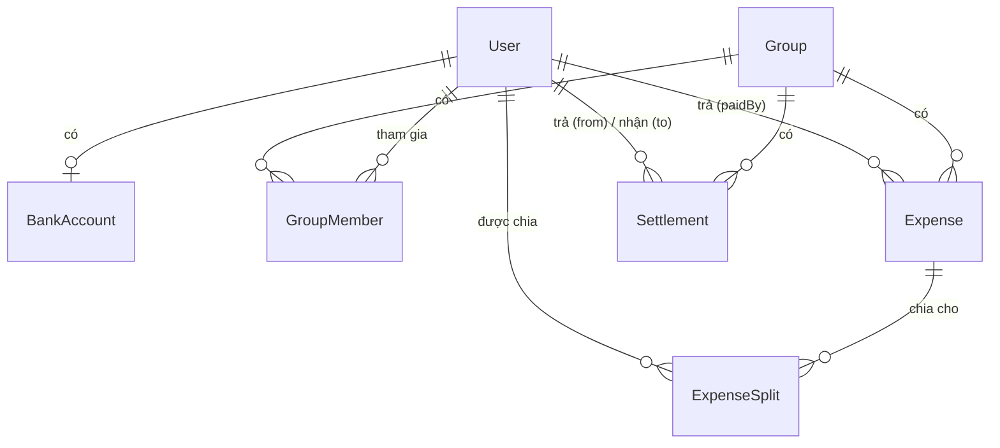

# KeePay

Ứng dụng di động **chia tiền nhóm & tạo mã VietQR** để thanh toán trực tiếp qua app ngân hàng.
Monorepo dùng npm workspaces, gồm 1 package dùng chung và 2 app.

```
keepay-monorepo/
├── apps/
│   ├── mobile/     React Native (Expo Router) — TypeScript, Clean Architecture theo feature
│   └── server/     NestJS + Prisma (PostgreSQL) — Controller → Service → Repository
├── packages/
│   └── shared/     Logic & contract dùng chung 2 phía: VietQR, chia tiền, zod schema
├── docs/adr/       Quyết định kiến trúc (Architecture Decision Records)
├── CONTRIBUTING.md Quy ước code, cách chia việc cho nhiều người/nhiều team
└── docker-compose.yml   PostgreSQL cho local dev
```

**Trạng thái:** khung kiến trúc + toàn bộ luồng chính (đăng ký → tạo nhóm → thêm khoản chi →
xem công nợ đã rút gọn → quét VietQR → ghi nhận đã thanh toán) đã có code thật, có test, build
được và chạy được. Còn thiếu: upload ảnh hoá đơn lên storage thật (S3/Cloudinary — hiện chỉ nhận
URL có sẵn), UI polish, chia theo % ở màn hình mobile (logic đã có ở `shared`, chưa nối UI), push
notification.

---

## Mục lục

1. [Quickstart](#quickstart)
2. [Kiến trúc & luồng dữ liệu](#kiến-trúc--luồng-dữ-liệu)
3. [`packages/shared` — logic dùng chung](#packagesshared--logic-dùng-chung)
4. [`apps/server` — chi tiết](#appsserver--chi-tiết)
5. [`apps/mobile` — chi tiết](#appsmobile--chi-tiết)
6. [Chạy test](#chạy-test)
7. [Đưa code lên Git (không dính file rác)](#đưa-code-lên-git-không-dính-file-rác)
8. [Câu hỏi thường gặp / sự cố](#câu-hỏi-thường-gặp--sự-cố)

---

## Quickstart

**Yêu cầu:** Node.js ≥ 20 (repo pin `22` trong `.nvmrc`), Docker (chỉ cần nếu muốn chạy app thật
với DB — chạy test thì không cần).

```bash
# 1. Cài dependency cho cả 3 package cùng lúc (npm workspaces)
npm install

# 2. Build package dùng chung trước — server & mobile import @keepay/shared từ dist/, không phải src/
npm run build:shared

# 3. Tạo file .env từ mẫu
cp apps/server/.env.example apps/server/.env
cp apps/mobile/.env.example apps/mobile/.env

# 4. Bật Postgres local
docker compose up -d

# 5. Tạo bảng + seed dữ liệu demo (3 user, mật khẩu: password123)
npm run prisma:migrate -w @keepay/server
npm run prisma:seed -w @keepay/server

# 6. Chạy server
npm run start:dev -w @keepay/server
# → http://localhost:3000/api/v1/health phải trả {"status":"ok"}
```

Mở terminal khác để chạy mobile:
```bash
npm run start -w @keepay/mobile
```
Quét QR bằng app **Expo Go**, hoặc bấm `a` (Android emulator) / `i` (iOS simulator). Nếu chạy
Android emulator, sửa `apps/mobile/.env` → `EXPO_PUBLIC_API_URL=http://10.0.2.2:3000/api/v1`
(emulator không thấy `localhost` của máy host qua tên đó).

> **Lỗi hay gặp:** bước `prisma generate` (chạy ngầm trong nhiều script) tải engine binary từ
> `binaries.prisma.sh`. Nếu mạng công ty/trường chặn domain này và báo `403 Forbidden`, set
> `export PRISMA_ENGINES_CHECKSUM_IGNORE_MISSING=1` rồi chạy lại lệnh. Đây là vấn đề tải binary,
> không phải lỗi trong code.

---

## Kiến trúc & luồng dữ liệu

```
Mobile (Expo)                     Server (NestJS)                  DB (Postgres)
┌─────────────────┐   HTTP/JSON   ┌──────────────────┐   Prisma    ┌───────────┐
│ presentation     │ ───────────► │ controller        │ ─────────► │           │
│ (screens, hooks) │               │ (validate + zod)  │             │  tables   │
│        ↓         │               │        ↓          │             │           │
│ domain (usecase) │               │ service           │ ◄─────────  └───────────┘
│  ← validate zod  │               │ (nghiệp vụ)        │
│        ↓         │               │        ↓          │
│ data (axios)      │               │ repository        │
└─────────────────┘               │ (abstract class)   │
        ▲                          └──────────────────┘
        └──────── @keepay/shared (VietQR, split, zod schema) dùng chung cả 2 phía ────────┘
```

Nguyên tắc chốt cho toàn bộ codebase:

- **`packages/shared` là nguồn sự thật duy nhất** cho: cấu trúc payload VietQR, công thức chia
  tiền, và zod schema validate request. Đổi 1 trong 3 thứ này → sửa ở đây → build lại → cả server
  lẫn mobile đều thấy lỗi type ngay nếu chưa cập nhật theo (bắt lỗi lúc build, không phải lúc chạy).
- **Server**: mỗi domain (`auth`, `groups`, `expenses`...) là 1 Nest module riêng, theo chuỗi
  `Controller → Service → Repository`. `Repository` là **abstract class** dùng làm DI token — Service
  chỉ biết interface, không biết Prisma tồn tại. Nhờ vậy test được bằng repository giả (in-memory)
  mà không cần Postgres thật đang chạy.
- **Mobile**: mỗi feature (`auth`, `group`, `expense`...) tự chứa đủ 3 tầng `presentation / domain /
  data`. Tầng `domain` (use case) là TypeScript thuần, **không import React hay axios** — nên test
  được bằng Vitest thường, không cần simulator. Route (`src/app/`) chỉ 1-2 dòng, import screen từ
  `features/*/presentation/screens`.

---

## `packages/shared` — logic dùng chung

```
packages/shared/src/
├── vietqr/
│   ├── crc16.ts           CRC-16/CCITT-FALSE — thuật toán checksum bắt buộc của chuẩn EMVCo
│   ├── text.ts             Bỏ dấu tiếng Việt (nội dung chuyển khoản phải là ASCII)
│   ├── bank-bins.ts        Danh sách mã BIN ngân hàng (NAPAS) — rút gọn, cần đối chiếu lại khi lên production
│   └── vietqr.builder.ts   buildVietQrPayload() — dựng chuỗi TLV theo chuẩn VietQR/EMVCo
│                           parseTlv() / verifyVietQrPayload() — để test và debug
├── money/
│   └── splits.ts           splitEqually() — chia đều có dư (rải 1đ cho người đầu, tổng luôn khớp)
│                           splitByPercent() — chia theo %, làm tròn dồn về người tỉ lệ lớn nhất
├── schemas/
│   └── index.ts             Toàn bộ zod schema cho request: register, login, tạo nhóm, tạo khoản
│                           chi (có validate tổng splits = amount), tạo settlement, sinh QR...
└── index.ts                 Export lại tất cả — server & mobile chỉ import từ '@keepay/shared'
```

**Vì sao VietQR nằm ở đây, không ở server hay mobile riêng?** Cả hai phía đều cần: mobile cần để
hiển thị QR ngay khi có dữ liệu (không phải lúc nào cũng gọi lại server), server cần để sinh QR
và có thể verify. Viết 1 lần, hai bên dùng chung tuyệt đối giống nhau — tránh trường hợp payload
lệch 1 tag là app ngân hàng từ chối quét.

Sau khi sửa code trong `packages/shared/src`, luôn chạy `npm run build:shared` trước khi test/chạy
app khác — chúng import từ `dist/`, không phải `src/`.

---

## `apps/server` — chi tiết

```
apps/server/
├── prisma/
│   ├── schema.prisma    Nguồn sự thật cho DB — mọi đổi schema phải qua migration
│   └── seed.ts            Tạo 3 user + 1 nhóm demo (mật khẩu: password123)
├── src/
│   ├── main.ts             Bootstrap: nạp .env, validate env bằng zod (loadEnv), setGlobalPrefix('api/v1')
│   ├── app.module.ts       Import tất cả module domain
│   ├── config/env.ts        Schema zod cho biến môi trường — app FAIL FAST nếu thiếu/sai biến
│   ├── prisma/               PrismaService (kết nối lazy qua @prisma/adapter-pg) + PrismaModule (@Global)
│   ├── common/
│   │   ├── security/         SecurityModule — JwtModule + JwtAuthGuard dùng chung, module nào
│   │   │                     cần bảo vệ route chỉ cần import module này
│   │   ├── guards/            JwtAuthGuard — đọc Bearer token, gắn req.user
│   │   ├── decorators/         @CurrentUser() — lấy user đang đăng nhập trong controller
│   │   └── pipes/               ZodValidationPipe — validate body bằng schema từ @keepay/shared
│   └── modules/
│       ├── auth/         register/login, phát JWT (hết hạn 7 ngày), hash mật khẩu bằng bcrypt
│       ├── users/         hồ sơ cá nhân + tài khoản ngân hàng nhận tiền (dùng để sinh VietQR)
│       ├── groups/         tạo nhóm, mời thành viên bằng EMAIL (không cần biết userId), phân quyền
│       │                    "chỉ thành viên nhóm mới xem/sửa được" nằm ở requireMember()
│       ├── expenses/       tạo khoản chi + splits trong 1 transaction (nested write của Prisma)
│       ├── balances/       debt-simplifier.ts — thuật toán rút gọn nợ (greedy: ghép con nợ lớn
│       │                    nhất với chủ nợ lớn nhất mỗi vòng) — có property-based test 200 vòng
│       │                    ngẫu nhiên để đảm bảo số dư luôn về 0 sau khi áp dụng kết quả
│       └── settlements/     ghi nhận đã thanh toán + sinh payload VietQR (đọc tài khoản ngân
│                            hàng của người NHẬN, không phải người trả)
└── test/
    ├── app.e2e-spec.ts       Test nguyên luồng qua HTTP thật (supertest), nhưng override Prisma
    │                          bằng repository in-memory → không cần Postgres đang chạy
    └── support/in-memory.repositories.ts   Bộ repository giả, implement đúng abstract class —
                                            copy mẫu này nếu bạn thêm module mới cần test
```

### Mô hình dữ liệu



Toàn bộ số tiền lưu dạng **số nguyên VND** (không dùng float) để tránh sai số làm tròn khi chia.

### API reference

Tất cả endpoint có prefix `/api/v1`. Route có 🔒 yêu cầu header `Authorization: Bearer <token>`.

| Method | Path | Mô tả |
|---|---|---|
| GET | `/health` | Kiểm tra server sống |
| POST | `/auth/register` | Đăng ký — trả về `{ accessToken, user }` |
| POST | `/auth/login` | Đăng nhập |
| 🔒 GET | `/users/me` | Hồ sơ + tài khoản ngân hàng của chính mình |
| 🔒 PUT | `/users/me/bank-account` | Lưu/cập nhật tài khoản nhận tiền (để sinh VietQR) |
| 🔒 POST | `/groups` | Tạo nhóm (`{ name, memberIds }`) |
| 🔒 GET | `/groups` | Danh sách nhóm mình tham gia |
| 🔒 GET | `/groups/:groupId` | Chi tiết nhóm, kèm tên từng thành viên |
| 🔒 POST | `/groups/:groupId/members` | Mời thành viên bằng `{ email }` |
| 🔒 POST | `/groups/:groupId/expenses` | Tạo khoản chi (`{ description, amount, paidById, splits }`) |
| 🔒 GET | `/groups/:groupId/expenses` | Danh sách khoản chi của nhóm |
| 🔒 GET | `/groups/:groupId/balances` | `{ net, debts }` — số dư từng người + nợ đã rút gọn |
| 🔒 POST | `/groups/:groupId/payment-qr` | Sinh payload VietQR (`{ toUserId, amount }`) |
| 🔒 POST | `/groups/:groupId/settlements` | Ghi nhận đã thanh toán (`{ fromUserId, toUserId, amount }`) |

Body request được validate bằng đúng schema trong `packages/shared/src/schemas` — xem file đó để
biết chính xác field nào bắt buộc, giới hạn độ dài/giá trị.

### Thêm một module mới (quy trình chuẩn)

1. `*.types.ts` — định nghĩa record trả về từ DB.
2. `*.repository.ts` — abstract class khai báo các method cần (không import Prisma).
3. `prisma-*.repository.ts` — implement bằng `PrismaService`.
4. `*.service.ts` — nghiệp vụ, chỉ phụ thuộc `*.repository.ts` (interface), không phụ thuộc Prisma.
5. `*.controller.ts` — nhận request, validate bằng `ZodValidationPipe` + schema từ `@keepay/shared`.
6. `*.module.ts` — đăng ký cả 4 thứ trên, `provide: XRepository, useClass: PrismaXRepository`.
7. Import module vào `app.module.ts`.

---

## `apps/mobile` — chi tiết

```
apps/mobile/src/
├── app/                          Expo Router — CHỈ ROUTING, mỗi file 1-2 dòng
│   ├── _layout.tsx                 Provider Redux + AuthGate (chặn vào app khi chưa đăng nhập)
│   ├── (auth)/login.tsx, register.tsx
│   ├── (main)/_layout.tsx           Bottom tabs: Nhóm / Bạn bè / Cá nhân
│   └── group/[id]/                   Chi tiết nhóm, tạo khoản chi, màn hình QR thanh toán
│
├── features/<tên-feature>/        Mỗi feature tự chứa đủ 3 tầng:
│   ├── domain/
│   │   ├── entities/                 Kiểu dữ liệu thuần (User, Group, Expense...)
│   │   ├── repositories/              Interface — domain KHÔNG biết axios tồn tại
│   │   └── usecases/                   Business logic + validate zod; ném AppError khi sai —
│   │                                  đây là phần được UNIT TEST (xem *.test.ts cạnh mỗi usecase)
│   ├── data/                          Implement interface trên bằng axios thật (*RepositoryImpl.ts)
│   ├── store/                          Redux slice (chỉ có ở auth, group — feature nào cần state
│   │                                  toàn cục mới có slice; phần lớn state là cục bộ trong screen)
│   └── presentation/
│       ├── screens/                    Màn hình đầy đủ
│       ├── components/                  UI con riêng của feature
│       └── hooks/                        Custom hook riêng của feature
│
├── core/                            Hạ tầng dùng chung, KHÔNG thuộc feature nào
│   ├── di/container.ts               ⭐ Composition root — nơi DUY NHẤT nối domain với data.
│   │                                 Thêm feature mới = viết xong bước trên, rồi "new UseCase(repo)"
│   │                                 ở đây. Không sửa file nào khác.
│   ├── api/httpClient.ts              axios instance, tự đính Bearer token vào mọi request
│   ├── store/                          configureStore — tiêm `container` vào mọi thunk qua
│   │                                  `extraArgument` (xem authSlice.ts để thấy cách dùng)
│   ├── storage/tokenStorage.ts         Access token lưu trong SecureStore (Keychain/Keystore),
│   │                                  không phải AsyncStorage — tránh lộ token nếu máy bị root/jailbreak
│   ├── error/                          AppError (lỗi domain) + toErrorMessage() (gộp mọi loại lỗi
│   │                                  thành 1 message tiếng Việt để hiển thị)
│   └── validation/parseOrThrow.ts       Validate bằng schema từ @keepay/shared, ném AppError
│
└── shared/                          UI & tiện ích dùng chung nhiều feature
    ├── components/                    Button, TextField, Screen (khung có ScrollView + style chuẩn)
    ├── vietqr/VietQRViewer.tsx          CHỈ vẽ QR từ payload có sẵn — không có logic VietQR ở đây
    ├── theme/colors.ts
    └── utils/formatCurrency.ts
```

### Vì sao tách domain/data/presentation ngay cả ở mobile?

Để đổi backend, đổi thư viện HTTP, hay viết test mà **không đụng vào UI**. Ví dụ
`CreateExpenseUseCase` (trong `features/expense/domain/usecases`) hoàn toàn không biết `axios` hay
`react-native` tồn tại — nó chỉ nhận input thô, validate, gọi qua interface `ExpenseRepository`.
Nhờ vậy 14 test của tầng domain chạy bằng Vitest thường (không cần simulator, không cần mở app),
và khi cần đổi từ REST sang GraphQL sau này thì chỉ viết lại `data/`, `domain/` giữ nguyên.

### Thêm một feature mới (quy trình chuẩn)

Copy cấu trúc của `features/expense` (feature vừa đủ phức tạp để làm mẫu):
1. `domain/entities` → kiểu dữ liệu.
2. `domain/repositories` → interface.
3. `domain/usecases` → logic + validate, kèm `*.test.ts`.
4. `data/*RepositoryImpl.ts` → implement bằng `httpClient` từ `core/api`.
5. Đăng ký use case trong `core/di/container.ts`.
6. `presentation/screens` → màn hình, gọi qua `container.<feature>.<usecase>.execute(...)`.
7. Route trong `app/` chỉ import và render screen đó.

---

## Chạy test

```bash
npm test -w @keepay/shared    # 16 test — không cần env/Docker
npm test -w @keepay/server    # 18 test — cần DATABASE_URL/JWT_SECRET nhưng dùng repository
                               # in-memory nên KHÔNG cần Postgres thật đang chạy
npm test -w @keepay/mobile    # 14 test — chỉ test tầng domain, không cần simulator
npm run check                 # lint + format + typecheck + test + build, tất cả 3 package
```

Chi tiết từng test đang kiểm tra gì: xem comment đầu mỗi file `*.test.ts` / `*.spec.ts`, hoặc hỏi
lại trong lúc trao đổi — README này không liệt kê lại để tránh lệch khi code test đổi.

---

## Đưa code lên Git (không dính file rác)

Thư mục bạn tải về **chưa có `.git`** (mình đã xoá lịch sử tạo lúc scaffold, để bạn tự init sạch).
`.gitignore` đã có sẵn đủ để loại các thứ không nên commit — kiểm tra trước khi tin nó:

```bash
cd keepay-monorepo
git init -b main
git add -A

# QUAN TRỌNG: nhìn qua danh sách trước khi commit thật
git status
```

Danh sách phải **KHÔNG** có: `node_modules`, `dist`, `.expo`, `coverage`, file `.env` (không phải
`.env.example`), `*.log`. Nếu lỡ thấy `node_modules` xuất hiện — thường là do bạn tạo file/thư mục
tên khác đúng pattern trong `.gitignore` bằng tool GUI nào đó ghi đè. Cách chắc ăn nhất để kiểm tra
nhanh mà không cuộn cả màn hình:

```bash
git status --porcelain | grep -E "node_modules|dist/|\.expo/|coverage/|\.env$"
# Không in ra dòng nào => sạch, an toàn để commit
```

Sau đó:
```bash
git commit -m "chore: scaffold KeePay monorepo"
git remote add origin <url-repo-của-bạn>
git push -u origin main
```

**Vài lưu ý khi làm việc nhiều người trên cùng repo này:**

- `package-lock.json` (root) **có commit** — đừng `.gitignore` nó. Đây là cách đảm bảo mọi người
  cài đúng cùng version dependency. Nếu bạn thêm package mới, luôn commit luôn `package-lock.json`
  bị đổi theo trong cùng 1 commit/PR.
- `apps/server/prisma/migrations/` **có commit** — đây là lịch sử thay đổi schema DB, không phải
  file sinh ra tạm thời. Đừng xoá hay gitignore thư mục này.
- `.env` từng máy tự tạo riêng từ `.env.example`, không bao giờ commit — vì chứa `JWT_SECRET`,
  `DATABASE_URL` có thể khác nhau (hoặc chứa credential thật) giữa các máy/môi trường.
- Nếu sau này chạy `npx expo prebuild` để build native, nó sẽ sinh ra `apps/mobile/ios/` và
  `apps/mobile/android/` — hai thư mục này **đã có sẵn trong `.gitignore`**, không cần lo.
- Trước khi mở PR, chạy `npm run check` — CI (`.github/workflows/ci.yml`) chạy đúng các bước đó,
  fail sớm ở máy bạn đỡ tốn thời gian chờ CI.

Xem thêm `CONTRIBUTING.md` để biết quy ước nhánh, commit message, và bảng chia khu vực làm việc
gợi ý cho nhiều người cùng code song song mà ít đụng file nhau.

---

## Câu hỏi thường gặp / sự cố

**`prisma generate` báo `403 Forbidden` khi tải engine binary**
→ Mạng đang chặn `binaries.prisma.sh`. Chạy `export PRISMA_ENGINES_CHECKSUM_IGNORE_MISSING=1`
rồi thử lại. Không phải lỗi code.

**Mobile chạy trên Android emulator nhưng gọi API bị timeout**
→ Emulator không hiểu `localhost` là máy host. Sửa `apps/mobile/.env`:
`EXPO_PUBLIC_API_URL=http://10.0.2.2:3000/api/v1`. Trên thiết bị thật, dùng IP LAN của máy chạy
server, ví dụ `http://192.168.1.5:3000/api/v1`.

**Sửa `packages/shared` xong nhưng server/mobile không thấy thay đổi**
→ Quên `npm run build:shared`. Cả hai app import từ `dist/`, không watch `src/` trực tiếp.

**Test server báo thiếu `JWT_SECRET`/`DATABASE_URL` dù có `.env`**
→ Jest test dùng `test/setup-env.ts` để tự set biến (không đọc `.env`). Nếu chạy `npm run
start:dev` mà báo lỗi này thì mới cần kiểm tra `apps/server/.env` có tồn tại và đúng format chưa
(copy lại từ `.env.example` nếu cần).
